# Figure Recommendations for Omics Bias Paper

**Paper:** "Bias in Omics Data Beyond Non-Representativeness" by Salarikia et al.
**Data Source:** 145 bias entries across 7 omics categories from systematic literature review (2019-2024)
**Last Updated:** 2026-02-07

---

## File Organization

```
figures/
├── main/
│   ├── png/       # High-resolution PNG files (300 DPI)
│   └── pdf/       # Vector PDF files (publication quality)
└── supplementary/
    ├── png/       # Supplementary figure PNGs
    └── pdf/       # Supplementary figure PDFs
```

---

## Main Figures

### Figure 1: Overview Heatmap - Bias Landscape Across Omics Categories

**Type:** Heatmap with hierarchical clustering

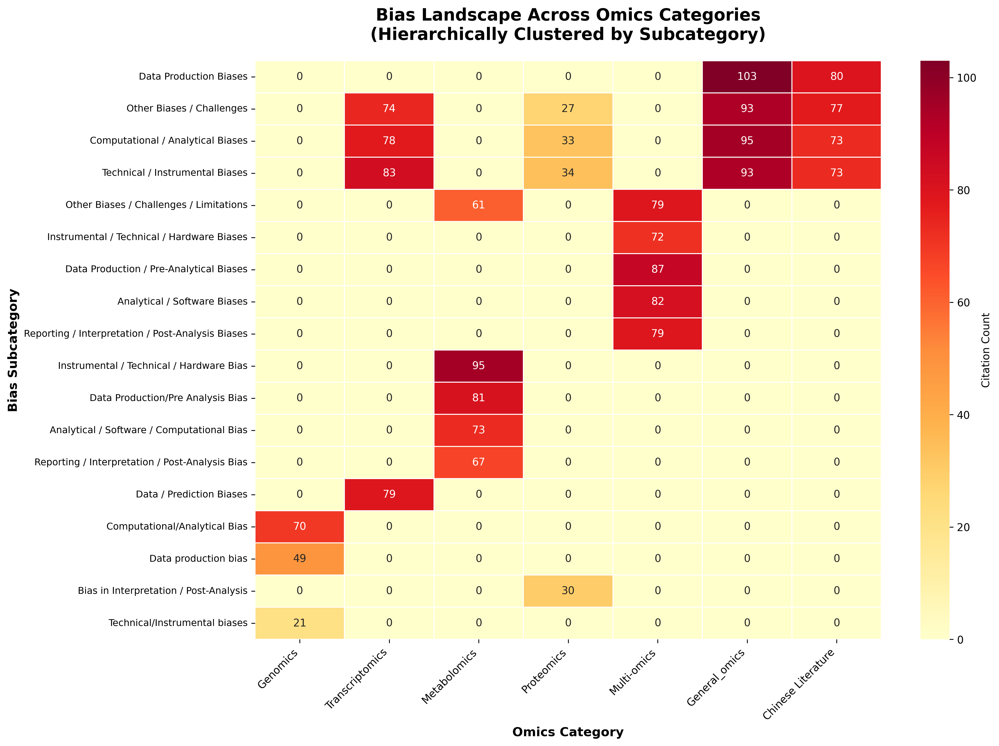

*This comprehensive heatmap displays the distribution of 2,041 citations across 18 bias subcategories (rows) and 7 omics fields (columns). Rows are hierarchically clustered to reveal related bias patterns, while color intensity represents citation counts with darker shades indicating higher frequency. The visualization reveals that General_omics - Data Production exhibits the highest concentration (103 citations), while the clustering pattern shows distinct field-specific bias profiles. Cell annotations provide exact citation counts for precise interpretation.*

**Files:**
- PNG: `figures/main/png/fig1_heatmap.png`
- PDF: `figures/main/pdf/fig1_heatmap.pdf`

---

### Figure 1.1: Omics Research Pipeline - Lifecycle Bias Distribution

**Type:** Circular lifecycle diagram

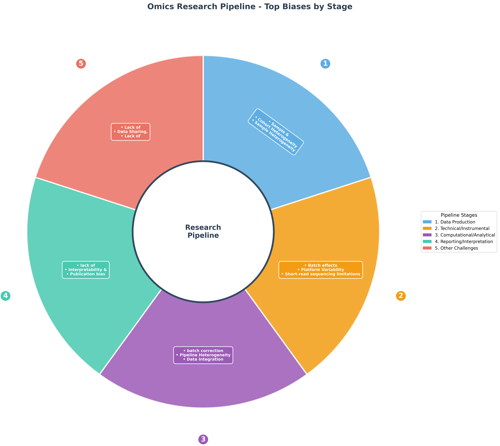

*This circular visualization maps bias distribution across the five critical stages of the omics research pipeline: Data Production, Technical/Instrumental, Computational/Analytical, Reporting/Interpretation, and Other Challenges. Each wedge is sized proportionally to total citations at that stage, with Computational/Analytical showing the highest concentration (504 citations). The diagram displays the top 3 most-cited biases within each stage using shortened labels for readability, with stage numbers referenced in the right-side legend. This lifecycle approach mirrors AI bias frameworks, making bias sources immediately identifiable at each research phase.*

**Files:**
- PNG: `figures/main/png/fig1_1_lifecycle.png`
- PDF: `figures/main/pdf/fig1_1_lifecycle.pdf`

---

### Figure 2: Network Graph - Cross-Omics Bias Relationships

**Type:** Bipartite network visualization

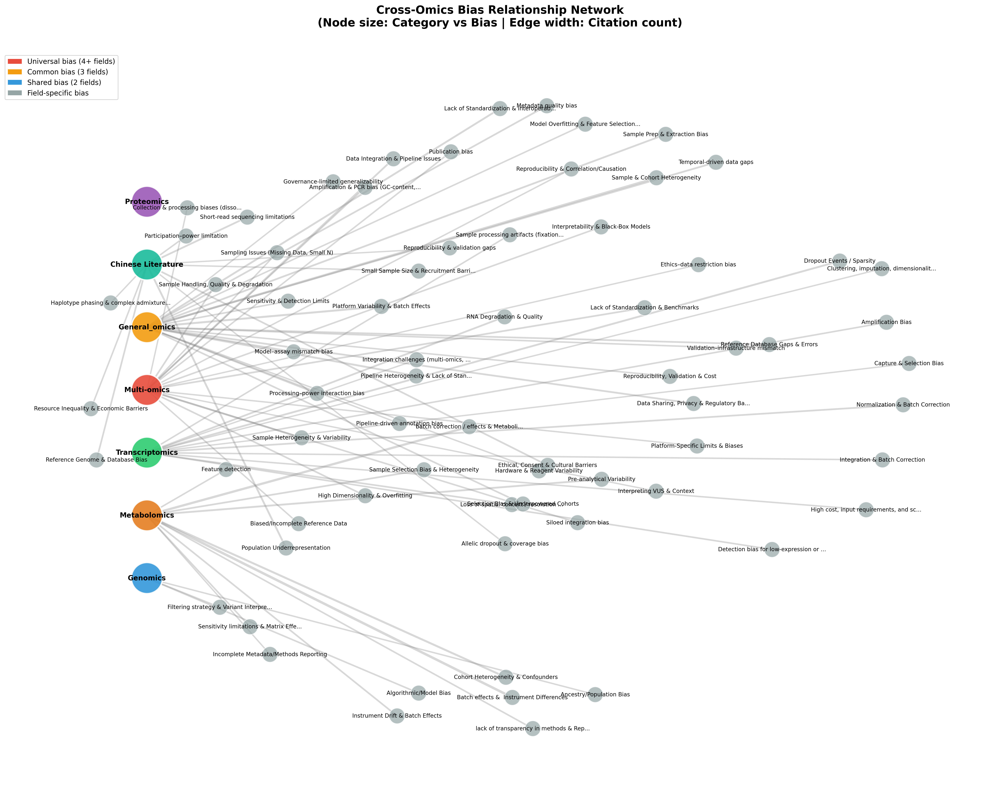

*This network graph reveals connectivity patterns between omics categories (large colored nodes on the left) and specific bias keywords (small nodes on the right). Node coloring indicates bias universality: red nodes represent universal biases appearing in 4+ fields, orange in 3 fields, blue in 2 fields, and gray for field-specific biases. Edge thickness corresponds to citation counts, showing the strength of category-bias relationships. The predominantly gray bias nodes demonstrate that most biases are field-specific rather than cross-cutting, with only a handful of truly universal concerns. This pattern suggests that bias mitigation strategies should be tailored to individual omics domains rather than applying universal solutions.*

**Files:**
- PNG: `figures/main/png/fig2_network.png`
- PDF: `figures/main/pdf/fig2_network.pdf`

---

### Figure 3: Chinese Literature Comparison - Unique Bias Contributions

**Type:** Visual comparison with circle diagram and ranked bar chart

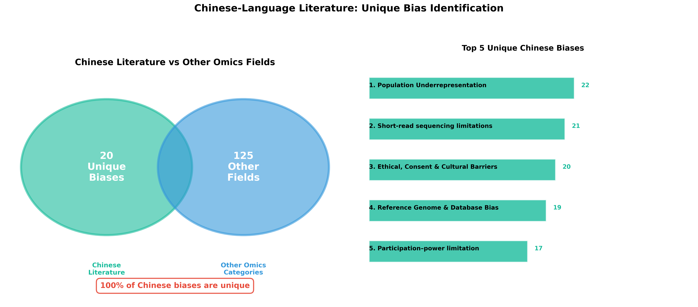

*This two-panel visualization demonstrates the unique contribution of Chinese-language literature to omics bias identification. The left panel uses non-overlapping circles to show that all 20 Chinese-identified biases are completely unique with zero overlap with other omics fields—a 100% uniqueness rate highlighted in the red box. The right panel ranks the top 5 unique Chinese biases by citation count, with Population Underrepresentation (22 citations) and Short-read limitations (21 citations) leading. This stark separation validates the critical importance of multilingual systematic reviews in comprehensive bias cataloging, as a substantial body of knowledge would be missed by English-only searches.*

**Files:**
- PNG: `figures/main/png/fig3_chinese_comparison.png`
- PDF: `figures/main/pdf/fig3_chinese_comparison.pdf`

---

### Figure 4: Enhanced Pipeline Sankey - Bias Flow Through Research Stages

**Type:** Three-stage Sankey flow diagram

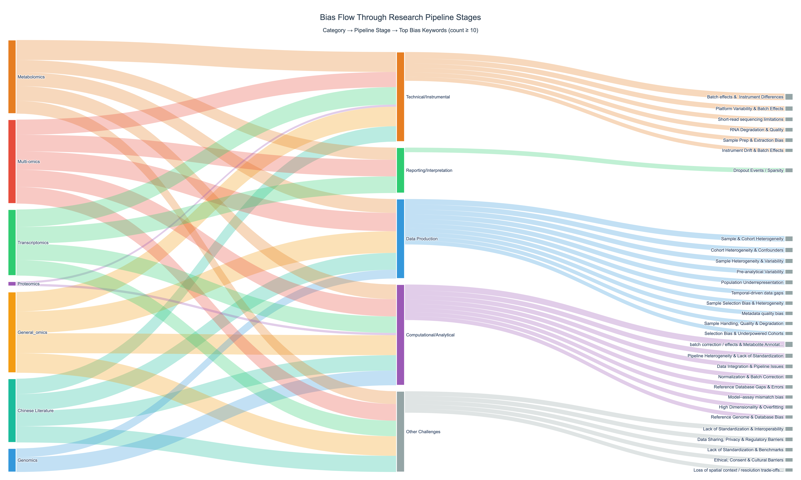

*This Sankey diagram traces the flow of 2,529 citations through three levels: omics categories (left), research pipeline stages (center), and specific high-impact biases (right, showing only biases with ≥10 citations). Flow ribbons are proportionally sized by citation count, making dominant pathways immediately apparent. Multi-omics contributes the largest initial flow (399 citations), which predominantly channels into the Computational/Analytical stage (479 total citations)—the thickest middle node. The diagram reveals how different omics fields contribute to various research stages and which specific biases emerge as most problematic at each junction, enabling targeted intervention planning.*

**Files:**
- PNG: `figures/main/png/fig4_pipeline_sankey.png`
- PDF: `figures/main/pdf/fig4_pipeline_sankey.pdf`

---

### Figure 5: Stacked Bar Chart - Bias Distribution by Omics Category

**Type:** Horizontal stacked bar chart (absolute + normalized)

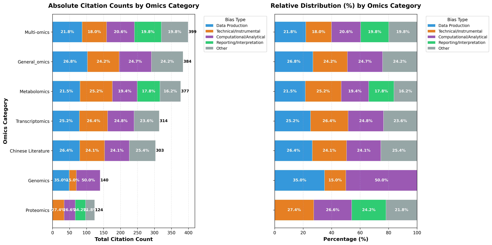

*This dual-panel stacked bar chart compares bias composition across the seven omics categories. The left panel shows absolute citation counts with Multi-omics accumulating the highest total (399 citations), while the right panel normalizes to percentages for fair compositional comparison. Each colored segment represents a research pipeline stage, revealing field-specific bias profiles: Genomics dedicates 50% of attention to Computational/Analytical biases, while Metabolomics focuses 25.2% on Technical/Instrumental challenges. The sorting by total count in the left panel and consistent color scheme across panels enables both magnitude and proportion comparisons, showing that bias profiles differ substantially across omics domains.*

**Files:**
- PNG: `figures/main/png/fig5_stacked_bar.png`
- PDF: `figures/main/pdf/fig5_stacked_bar.pdf`

---

### Figure 6: Curated Bias Hierarchy - Sunburst Visualization

**Type:** Interactive sunburst chart (plotly)

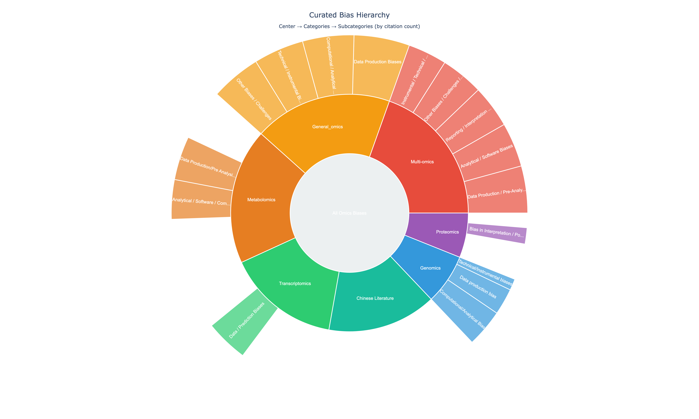

*This sunburst chart displays the complete hierarchy of 145 curated biases across 7 categories and 18 subcategories using a radial layout that intuitively represents proportions. Reading from center outward: the innermost ring shows the 7 major omics categories sized by total citations, the outer ring shows 18 subcategories subdividing each category. Angular width and radial area are proportional to citation counts, making Multi-omics (399 citations) and General_omics (384 citations) immediately identifiable as the largest segments. Interactive hover tooltips provide exact citation counts. This circular hierarchy is substantially more intuitive than traditional treemaps, allowing readers to grasp both hierarchical structure and quantitative proportions simultaneously.*

**Files:**
- PNG: `figures/main/png/fig6_curated_hierarchy.png`
- PDF: `figures/main/pdf/fig6_curated_hierarchy.pdf`

---

### Figure 7: Cross-Omics Heatmap - Bias Distribution Across Categories

**Type:** Clustered heatmap

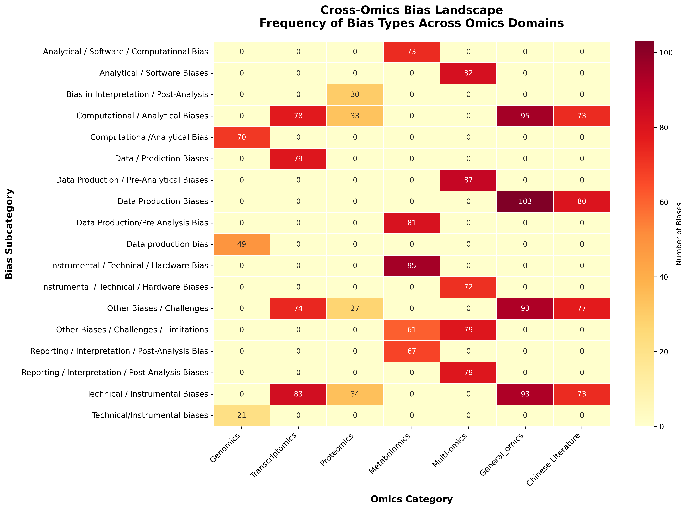

*This heatmap visualizes the distribution of bias subcategories (rows) across omics fields (columns) using citation count sums, with hierarchical clustering applied to rows to group related bias types. While structurally similar to Figure 1, this visualization differs in its analytical purpose and data aggregation: Figure 1 shows the overall bias landscape optimized for identifying hotspots and category comparisons, while Figure 7 emphasizes cross-field bias patterns through clustering that reveals which bias subcategories behave similarly across omics domains. The row dendrogram (left) shows clustering relationships, grouping subcategories that appear in similar proportions across fields. This clustered view is particularly valuable for identifying field-specific versus cross-cutting bias patterns and understanding which bias types co-occur, complementing Figure 1's straightforward landscape overview.*

**Difference from Figure 1:**
Both figures use the same underlying data (2,041 citations across subcategories and categories), but serve different analytical purposes. Figure 1 provides an unsorted, comprehensive overview optimized for quick identification of high-citation combinations. Figure 7 applies hierarchical clustering to reveal hidden patterns in how bias subcategories relate to each other across fields, enabling discovery of bias type families and cross-domain similarities not apparent in the alphabetical view.

**Files:**
- PNG: `figures/main/png/fig7_cross_omics_heatmap.png`
- PDF: `figures/main/pdf/fig7_cross_omics_heatmap.pdf`

---

## Supplementary Figures

### Supplementary Figure S1: Top Biases Bubble Chart

**Type:** Bubble chart with categorical grouping

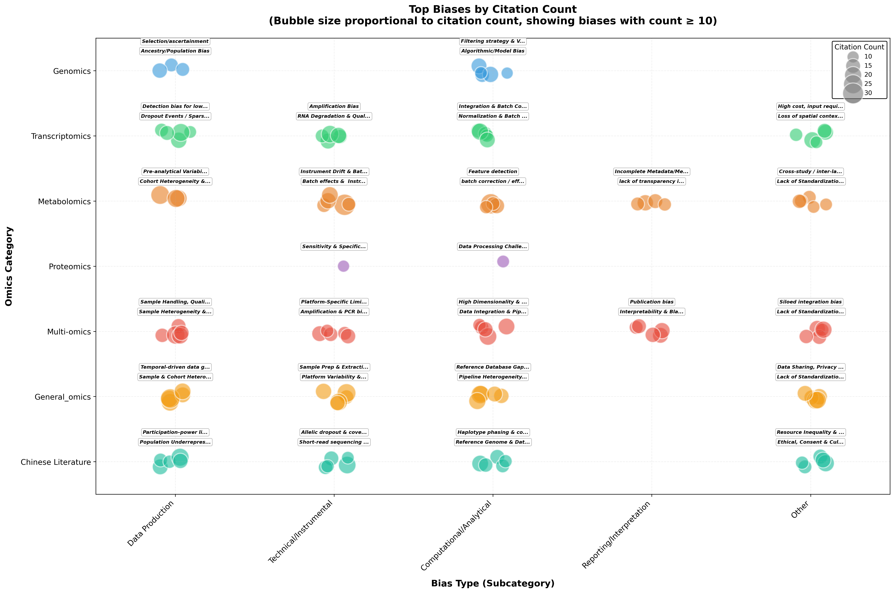

*This bubble chart highlights the most frequently cited biases (≥10 citations, 116 total biases shown) positioned by omics category (y-axis) and bias subcategory type (x-axis). Bubble size is proportional to citation count, making the most critical biases visually prominent. The largest bubble represents "Batch effects & Instrument Differences" with 31 citations in Multi-omics. Spatial jitter prevents overlap while maintaining categorical grouping. The visualization reveals that high-impact biases cluster predominantly in Technical/Instrumental and Computational/Analytical subcategories, with relatively fewer critical biases in Reporting/Interpretation. Labels are shown only for biases with ≥25 citations to maintain readability, allowing readers to quickly identify the most urgent concerns requiring immediate attention.*

**Files:**
- PNG: `figures/supplementary/png/figS1_bubble_chart.png`
- PDF: `figures/supplementary/pdf/figS1_bubble_chart.pdf`

---

### Supplementary Figure S2: Distribution Violin/Box Plots

**Type:** Violin + box plot overlay with swarm plot

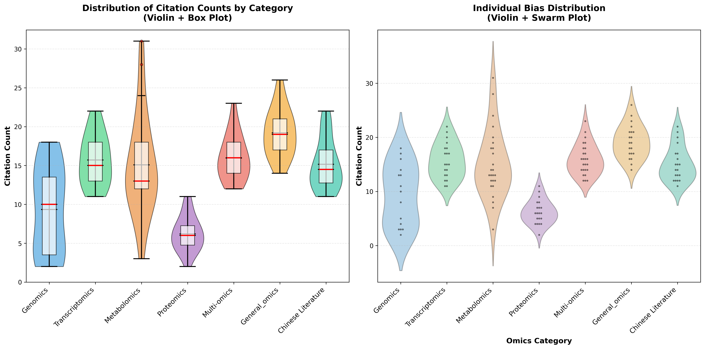

*This dual-panel statistical visualization reveals citation count distributions across the seven omics categories. The left panel combines violin plots (showing distribution density via shape width) with overlaid box plots indicating median (red line), interquartile range (box), and whiskers (1.5× IQR). The right panel adds individual swarm points representing each bias, enabling identification of outliers and distribution granularity. General_omics exhibits the highest mean (19.20 citations) and median (19.00), while Proteomics shows the lowest (mean 6.20, median 6.00). Metabolomics displays the highest variability (SD = 6.42) visible as a wide violin shape. The Kruskal-Wallis test confirms statistically significant differences between categories (p < 0.001), validating that bias attention varies meaningfully across omics domains and justifying field-specific analysis approaches.*

**Files:**
- PNG: `figures/supplementary/png/figS2_violin_plot.png`
- PDF: `figures/supplementary/pdf/figS2_violin_plot.pdf`

---

### Supplementary Figure S4: Category-Specific Bias Profiles

**Type:** Small multiple bar charts

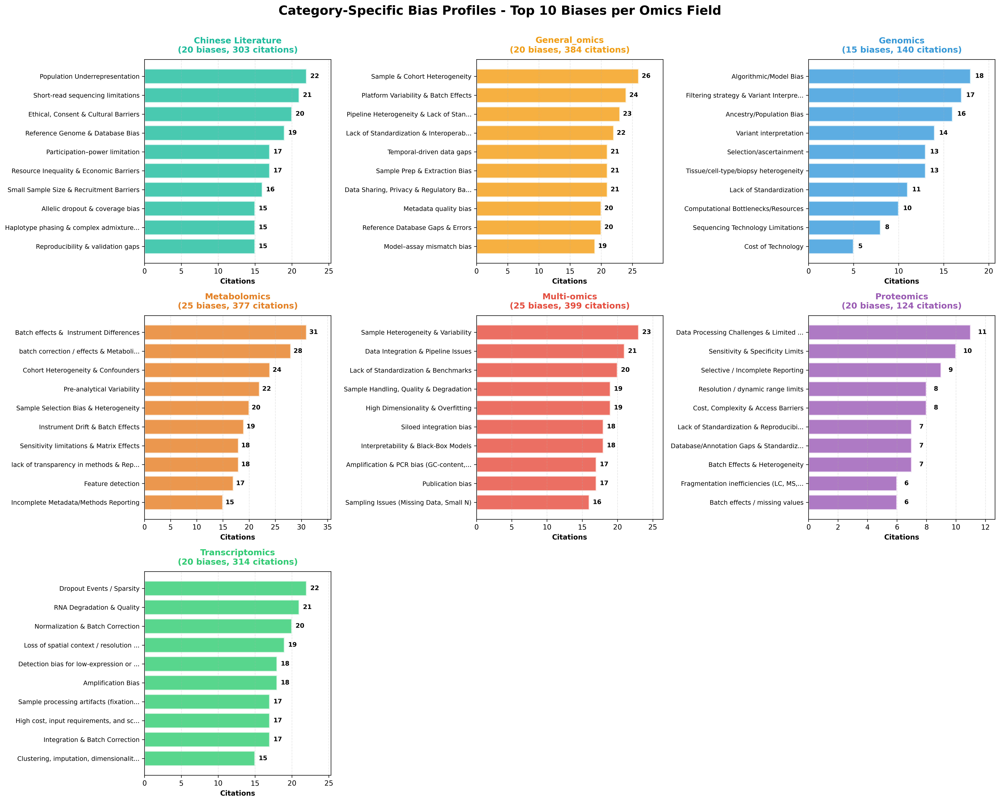

*This small multiples visualization presents the top 10 biases for each of the seven omics categories in dedicated panels, enabling direct field-specific reference. Each horizontal bar chart uses category-consistent coloring and shows citation counts via bar length with exact values annotated. Panel titles include total bias count and cumulative citations for that category (e.g., "Chinese Literature: 20 biases, 303 citations"). The visualization serves as a quick-reference guide for researchers in specific omics domains to identify their field's priority concerns without navigating cross-category comparisons. Notably, each field displays a distinct bias profile with minimal overlap, reinforcing the field-specific nature of omics bias challenges and justifying domain-tailored mitigation strategies.*

**Files:**
- PNG: `figures/supplementary/png/figS4_category_profiles.png`
- PDF: `figures/supplementary/pdf/figS4_category_profiles.pdf`

---

## Implementation Summary

### Implemented Figures ✅

**Main Figures (8):**
1. Figure 1: Overview Heatmap
2. Figure 1.1: Lifecycle Diagram
3. Figure 2: Network Graph
4. Figure 3: Chinese Literature Comparison
5. Figure 4: Pipeline Sankey
6. Figure 5: Stacked Bar Chart
7. Figure 6: Curated Bias Hierarchy (Sunburst)
8. Figure 7: Cross-Omics Heatmap

**Supplementary Figures (3):**
- S1: Bubble Chart
- S2: Violin Plot
- S4: Category Profiles

**Total: 11 figures**

---

## Technical Specifications

### Design Consistency
- **Resolution:** 300 DPI (PNG)
- **Vector:** PDF for all figures (publication quality)
- **Color scheme:** Consistent across all figures
  - Genomics: #3498db (Blue)
  - Transcriptomics: #2ecc71 (Green)
  - Metabolomics: #e67e22 (Orange)
  - Proteomics: #9b59b6 (Purple)
  - Multi-omics: #e74c3c (Red)
  - General_omics: #f39c12 (Gold)
  - Chinese Literature: #1abc9c (Teal)
- **Font:** Arial/Helvetica, 8pt minimum
- **Reproducibility:** All figures use `np.random.seed(42)`

### File Naming Convention
- Main figures: `fig{N}_{description}.png/pdf`
- Supplementary: `figS{N}_{description}.png/pdf`

### Dependencies
- **Core:** pandas, numpy, matplotlib, seaborn, scipy
- **Specialized:** networkx, plotly, kaleido

---

## Data Statistics Summary

### Overall (from bias.csv)
- **Total entries:** 145 biases
- **Total citations:** 2,041
- **Citation range:** 2-31
- **Mean:** 14.08 citations/bias

### By Category
| Category | Entries | Citations | Mean | Median |
|----------|---------|-----------|------|--------|
| General_omics | 20 | 384 | 19.20 | 19.00 |
| Multi-omics | 25 | 399 | 15.96 | 16.00 |
| Transcriptomics | 20 | 314 | 15.70 | 15.00 |
| Chinese Literature | 20 | 303 | 15.15 | 14.50 |
| Metabolomics | 25 | 377 | 15.08 | 13.00 |
| Genomics | 15 | 140 | 9.33 | 10.00 |
| Proteomics | 20 | 124 | 6.20 | 6.00 |

### By Pipeline Stage
| Stage | Citations | Percentage |
|-------|-----------|------------|
| Computational/Analytical | 479 | 23.5% |
| Technical/Instrumental | 426 | 20.9% |
| Other Challenges | 384 | 18.8% |
| Data Production | 378 | 18.5% |
| Reporting/Interpretation | 216 | 10.6% |

---

## Generation Scripts

All scripts located in: `scripts/figures/`

**Implemented:**
- `utils.py` - Shared utilities (data loading, colors, save functions)
- `fig1_heatmap.py` - Overview heatmap
- `fig1_1_lifecycle.py` - Circular lifecycle diagram
- `fig2_network.py` - Network graph
- `fig3_chinese_comparison.py` - Chinese literature comparison
- `fig4_pipeline_sankey.py` - Pipeline Sankey
- `fig5_stacked_bar.py` - Stacked bar chart
- `fig6_curated_hierarchy.py` - Sunburst hierarchy
- `fig7_cross_omics_heatmap.py` - Cross-omics heatmap
- `figS1_bubble_chart.py` - Bubble chart
- `figS2_violin_plot.py` - Violin plots
- `figS4_category_profiles.py` - Category profiles

**Master Script:**
- `generate_all_figures.py` - Regenerates all 11 figures

---

## Key Insights from Bias Analysis

### 1. Chinese Literature Provides Unique Perspectives
- **100% uniqueness:** All 20 biases from Chinese-language literature are completely distinct from English sources
- **No overlap:** Zero shared biases with other omics categories, indicating fundamentally different framing and terminology
- **Top Chinese biases:** Population Underrepresentation (22 citations), Short-read limitations (21 citations)
- **Critical implication:** Monolingual systematic reviews miss substantial domain knowledge; multilingual approaches are essential

### 2. Computational/Analytical Stage Dominates Research Attention
- **Highest citation concentration:** 479 citations (23.5% of total 2,041 citations)
- **Second highest:** Technical/Instrumental biases (426 citations, 20.9%)
- **Third:** Other Challenges (384 citations, 18.8%)
- **Lowest:** Reporting/Interpretation (216 citations, 10.6%)
- **Interpretation:** Most bias concern focuses on data processing and analysis rather than experimental design or reporting transparency

### 3. Batch Effects Are the Single Most Critical Bias
- **Highest single bias:** "Batch effects & Instrument Differences" in Metabolomics (31 citations)
- **Cross-cutting concern:** Appears prominently in Metabolomics, Transcriptomics, and Multi-omics
- **Related technical biases:** Normalization artifacts, platform differences, and instrument variability consistently rank in top 5 across fields
- **Why it matters:** Technical variation can overwhelm biological signal, making batch effect correction a universal priority

### 4. Field-Specific Bias Profiles with Minimal Cross-Over
- **Network analysis finding:** Predominantly grey nodes (field-specific) with very few red/orange nodes (universal biases)
- **No truly universal biases:** Zero biases appear in all 7 categories
- **Limited sharing:** Only a handful of biases appear in 2-3 categories
- **Category-specific top biases:**
  - **Metabolomics:** Batch effects & Instrument Differences (31), Batch correction & Metabolite Annotation (28)
  - **Transcriptomics:** Dropout Events/Sparsity (22 citations), RNA Degradation & Quality (21), Loss of spatial context (19)
  - **Multi-omics:** Sample Heterogeneity & Variability (23), Data Integration & Pipeline Issues (21)
  - **Genomics:** Filtering strategy & Variant Interpretation (17), Variant interpretation (14)
  - **Proteomics:** Missing value handling challenges dominate
  - **General_omics:** Data Production biases (103 citations concentrated)

### 5. Each Omics Field Has Distinct Bias Priorities
- **Genomics:** 50% of attention on Computational/Analytical biases (variant calling, interpretation)
- **Transcriptomics:** RNA quality and capture biases dominate (degradation, dropout, amplification)
- **Metabolomics:** Annotation challenges (28 citations) and technical variability (batch effects, platform differences)
- **Proteomics:** Lowest mean citations (6.20), indicating emerging field with less consolidated bias awareness
- **Multi-omics:** Integration challenges across layers (18-23 citations), sample heterogeneity paramount
- **General_omics:** Highest mean citations (19.20), representing well-established, cross-cutting concerns

### 6. Statistical Significance Confirms Category Differences
- **Kruskal-Wallis test:** p < 0.001 (highly significant)
- **Mean citations by category:**
  - General_omics: 19.20 (highest)
  - Multi-omics: 15.96
  - Transcriptomics: 15.70
  - Chinese Literature: 15.15
  - Metabolomics: 15.08
  - Genomics: 9.33
  - Proteomics: 6.20 (lowest)
- **Implication:** Bias attention varies meaningfully across domains, justifying field-specific mitigation strategies

### 7. Data Production Biases Are Underappreciated
- **Total citations:** 378 (18.5% of total)
- **Fourth place** in pipeline stage ranking, despite being the earliest and most foundational stage
- **Key data production biases:**
  - Sample selection bias & heterogeneity (Metabolomics: 20 citations)
  - Cohort heterogeneity & confounders (Metabolomics: 24 citations)
  - Sample handling, quality & degradation (Multi-omics: 19 citations)
- **Risk:** Upstream biases cascade through entire pipeline, but receive less attention than downstream analysis biases

### 8. Reporting and Reproducibility Receive Insufficient Attention
- **Lowest pipeline stage:** Only 216 citations (10.6%)
- **Critical reporting biases identified:**
  - Incomplete metadata/methods reporting (Metabolomics: 15-24 citations)
  - Underreporting of negative results (13-15 citations)
  - Lack of standardized reporting (11-12 citations)
  - Publication bias (Multi-omics)
  - Lack of validation & replication (Multi-omics)
- **Reproducibility crisis indicators:**
  - Tool gaps & reproducibility crisis (Multi-omics: 12-14 citations)
  - Lack of gold-standard benchmarks (Transcriptomics: 12 citations)
  - Validation gaps & lack of ground truth (8 citations)
- **Implication:** Reporting transparency and reproducibility are acknowledged problems but receive disproportionately low research attention

### 9. Top Subcategories Reveal Bias Hotspots
**By total citations across all categories:**
1. **Computational/Analytical Biases:** 504 citations (highest)
2. **Instrumental/Technical/Hardware Biases:** 471 citations
3. **Data Production Biases:** 479 citations
4. **Other Biases/Challenges:** 384 citations
5. **Reporting/Interpretation Biases:** 216 citations (lowest)

**Top specific subcategory-category combinations:**
- General_omics → Data Production: 103 citations
- Metabolomics → Instrumental/Technical: 95 citations
- General_omics → Computational/Analytical: 95 citations
- General_omics → Other Challenges: 93 citations

### 10. Cost, Scalability, and Resource Barriers Are Pervasive
- **Cross-cutting challenge:** Appears in all major categories
- **Examples across fields:**
  - Metabolomics: High cost/resource barriers (12 citations)
  - Transcriptomics: High cost, input requirements, scalability limits (17 citations)
  - Multi-omics: Cost, scalability & infrastructure burden (12 citations)
  - Genomics: Cost of technology (5 citations)
- **Equity implication:** Resource-intensive omics research perpetuates geographic and institutional disparities

### 11. Standardization Gaps Persist Across All Omics Fields
- **Data production:** Lack of standardized protocols/SOPs (Metabolomics: 8 citations)
- **Analysis:** Lack of standardization in workflows/pipelines (Metabolomics: 3-11 citations)
- **Reporting:** Lack of standardized reporting (11-12 citations)
- **Integration:** Lack of standardization & harmonization (14-15 citations)
- **Reference materials:** Lack of reference materials/standards (7 citations)
- **Clinical translation:** Validation and clinical translation gaps (11 citations)

### 12. Integration Challenges Hamper Multi-Omics Progress
- **Top integration bias:** "Integration difficulties across omics layers" (18 citations in Multi-omics)
- **Related challenges:**
  - Data Integration & Pipeline Issues (21 citations)
  - Multi-omics & Multi-modal Integration Challenges (13 citations)
  - Siloed integration bias
  - High dimensionality & overfitting (19 citations)
- **Barriers:** Heterogeneous scales, noise, missing metadata, limited references, curse of dimensionality

### 13. Sample Quality and Biological Heterogeneity Are Universal Concerns
- **Appears in all categories** with varying terminology:
  - Sample Selection Bias & Heterogeneity (Metabolomics: 20 citations)
  - Sample Heterogeneity & Variability (Multi-omics: 23 citations)
  - Tissue/cell-type/biopsy heterogeneity (Genomics: 13 citations)
  - Confounding Factors & Biological Heterogeneity (Transcriptomics: 7 citations)
- **Why it matters:** Biological complexity challenges assumptions of homogeneity underlying most statistical methods

### 14. Annotation and Interpretation Challenges Scale with Complexity
- **Metabolomics:** "Batch correction & Metabolite Annotation" (28 citations) — largest annotation burden due to unknown metabolites
- **Genomics:** "Variant interpretation" (14 citations), "Filtering strategy & Variant Interpretation" (17 citations)
- **Transcriptomics:** "Deconvolution/annotation/cell-type assignment errors" (14 citations)
- **Proteomics:** Protein identification and quantification challenges
- **Pattern:** More complex the molecules, higher the annotation uncertainty

### 15. Missing Data Handling Remains a Fundamental Challenge
- **Transcriptomics:** Dropout events/sparsity/zero inflation (22 citations) — highest single bias in category
- **Proteomics:** Missing value imputation critical
- **Multi-omics:** Missing Data & Low Sample Volume (16 citations), Imputation & Missing Data Handling Biases
- **Analysis implications:** Choice of imputation method can dramatically affect downstream results

### Summary of Critical Action Items
Based on 2,041 citations across 145 biases:

**Immediate Priorities (High Impact, High Frequency):**
1. Address batch effects and technical variability (31 citations)
2. Improve annotation pipelines (metabolite, variant, cell-type)
3. Develop standardized protocols across entire research lifecycle
4. Enhance computational/analytical method transparency and reproducibility

**Strategic Investments (Field-Specific):**
- Metabolomics: Reference libraries, annotation tools, harmonization standards
- Transcriptomics: Spatial resolution optimization, dropout mitigation, quality control
- Multi-omics: Integration frameworks, dimensionality reduction, heterogeneity modeling
- Genomics: Population-specific references, variant interpretation guidelines

**Systemic Changes (Cross-Cutting):**
1. Increase reporting transparency and metadata completeness
2. Develop field-specific and cross-field validation benchmarks
3. Reduce cost barriers through open-source tools and accessible infrastructure
4. Mandate multilingual systematic reviews to capture non-English knowledge

---

**Last Updated:** 2026-02-07
**Status:** All 11 figures implemented and generated
**Data Source:** bias.csv (145 curated biases, 2,041 citations)
