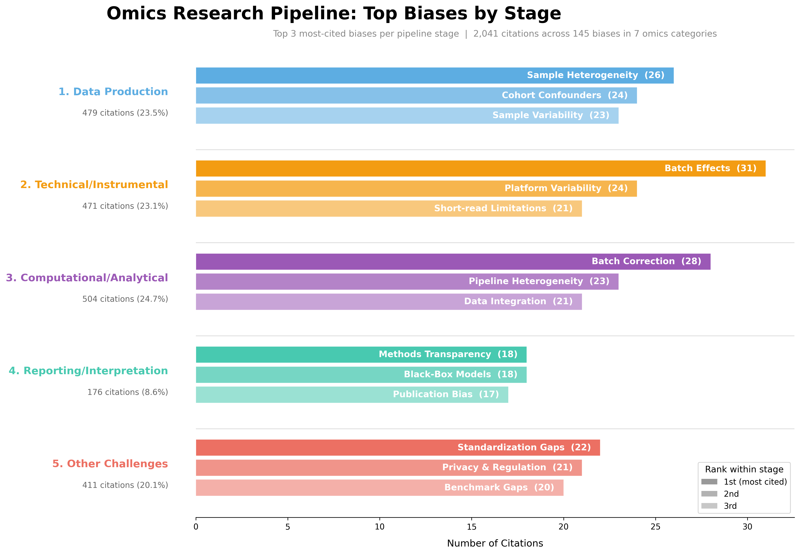
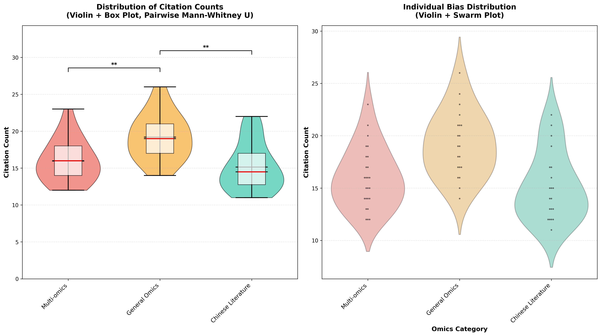

# Figure Recommendations for Omics Bias Paper

**Paper:** "Bias in Omics Data Beyond Non-Representativeness" by Salarikia et al.
**Data Source:** 145 bias entries across 7 omics categories from systematic literature review (2019-2024)
**Last Updated:** 2026-02-27

---

## Table of Contents

### Main Figures
1. [Figure 1: Overview Heatmap](#figure-1-overview-heatmap---bias-landscape-across-omics-categories)
2. [Figure 1.1: Lifecycle Diagram](#figure-11-omics-research-pipeline---lifecycle-bias-distribution)
3. [Figure 1.2: Pipeline Bars](#figure-12-omics-research-pipeline---top-biases-by-stage-bar-chart)
4. [Figure 2: Network Graph](#figure-2-network-graph---cross-omics-bias-relationships)
5. [Figure 3: Chinese Literature Comparison](#figure-3-chinese-literature-comparison---unique-bias-contributions)
6. [Figure 4: Pipeline Sankey](#figure-4-enhanced-pipeline-sankey---bias-flow-through-research-stages)
7. [Figure 5: Stacked Bar Chart](#figure-5-stacked-bar-chart---bias-distribution-by-omics-category)
8. [Figure 6: Curated Hierarchy (Sunburst)](#figure-6-curated-bias-hierarchy---sunburst-visualization)
9. [Figure 7: Cross-Omics Heatmap](#figure-7-cross-omics-heatmap---bias-distribution-across-categories)

### Supplementary Figures
- [Figure S1: Bubble Chart](#supplementary-figure-s1-top-biases-bubble-chart)
- [Figure S2: Violin/Box Plots](#supplementary-figure-s2-distribution-violinbox-plots)
- [Figure S3: Aggregated Category Violins](#supplementary-figure-s3-aggregated-category-violinbox-plots-new)- [Figure S4: Category Profiles](#supplementary-figure-s4-category-specific-bias-profiles)

### Tables & Technical Details
- [Subcategory Normalization](#subcategory-normalization)
- [Chinese Keyword Harmonization](#chinese-keyword-harmonization)
- [Semantic Keyword Merging](#semantic-keyword-merging)
- [Data Statistics Summary](#data-statistics-summary)
- [Questions & Uncertainties for Review](#questions--uncertainties-for-review)

---

## File Organization

```
figures/
├── main/
│   ├── png/       # High-resolution PNG files (300 DPI)
│   └── pdf/       # Vector PDF files (publication quality)
└── supplementary/
    ├── png/       # Supplementary figure PNGs
    └── pdf/       # Supplementary figure PDFs
```

---

## Main Figures

### Figure 1: Overview Heatmap - Bias Landscape Across Omics Categories

**Type:** Heatmap with hierarchical clustering


*This comprehensive heatmap displays the distribution of 2,041 citations across 5 bias subcategories (rows) and 7 omics fields (columns). Rows are hierarchically clustered to reveal related bias patterns, while color intensity represents citation counts with darker shades indicating higher frequency. The visualization reveals that General Omics - Data Production exhibits the highest concentration (103 citations), while the clustering pattern shows distinct field-specific bias profiles. Cell annotations provide exact citation counts for precise interpretation.*

**How each cell value is calculated:** Each cell = sum of `Final count` from `data/bias.csv` for all individual bias keywords belonging to that (Category, Subcategory) pair. For example, Genomics × Data Production Biases = 49, which is the sum of 4 keywords: Selection/ascertainment (13) + Tissue/cell-type heterogeneity (13) + Lack of Population-Specific Databases (3) + Sample size/underpowered (4) + Ancestry/Population Bias (16). Subcategory names are normalized from 18 curator variants to 5 canonical stages (see [Subcategory Normalization](#subcategory-normalization)).

**Files:**
- PNG: `figures/main/png/fig1_heatmap.png`
- PDF: `figures/main/pdf/fig1_heatmap.pdf`

---

### Figure 1.1: Omics Research Pipeline - Lifecycle Bias Distribution

**Type:** Circular lifecycle diagram


*This circular visualization maps bias distribution across the five canonical pipeline stages: (1) Data Production, (2) Technical/Instrumental, (3) Computational/Analytical, (4) Reporting/Interpretation, and (5) Other Challenges. Each wedge displays the top 3 most-cited biases within that stage using shortened labels for readability. Subcategory names are normalized from 18 curator variants to these 5 canonical stages (see [Subcategory Normalization](#subcategory-normalization)). Computational/Analytical shows the highest citation concentration (504 citations, 35 biases), followed by Data Production (479 citations) and Technical/Instrumental (471 citations). Reporting/Interpretation receives the least attention (176 citations, 15 biases), highlighting a gap in research focus on downstream transparency.*

**Files:**
- PNG: `figures/main/png/fig1_1_lifecycle.png`
- PDF: `figures/main/pdf/fig1_1_lifecycle.pdf`

---

### Figure 1.2: Omics Research Pipeline - Top Biases by Stage (Bar Chart)

**Type:** Horizontal grouped bar chart



*This bar chart maps bias distribution across the five canonical pipeline stages: (1) Data Production, (2) Technical/Instrumental, (3) Computational/Analytical, (4) Reporting/Interpretation, and (5) Other Challenges. For each stage, the three most-cited individual biases are displayed, with bar length proportional to citation count. Biases are pooled across all seven omics categories. For example: "Batch effects & instrument differences" (31 citations) originates primarily from metabolomics, while "Dropout events/sparsity" (22 citations) derives predominantly from transcriptomics. Subcategory names are normalized from 18 curator variants to these 5 canonical stages (see [Subcategory Normalization](#subcategory-normalization)). Computational/Analytical shows the highest citation concentration (504 citations), followed by Data Production (479 citations) and Technical/Instrumental (471 citations). Reporting/Interpretation contains the fewest reported biases (176 citations), suggesting that downstream transparency challenges may be underrepresented in the current literature.*

**Files:**
- PNG: `figures/main/png/fig1_2_pipeline_bars.png`
- PDF: `figures/main/pdf/fig1_2_pipeline_bars.pdf`

---

### Figure 2: Network Graph - Cross-Omics Bias Relationships

**Type:** Bipartite network visualization


*This network graph reveals connectivity patterns between omics categories (large colored nodes on the left) and specific bias keywords (smaller nodes on the right). Bias node color indicates the pipeline stage (subcategory): Data Production (light blue), Technical/Instrumental (orange), Computational/Analytical (purple), Reporting/Interpretation (teal), and Other Challenges (red). Bias node size encodes cross-field universality—larger nodes appear in more omics categories. Edge thickness corresponds to citation counts, showing the strength of category-bias relationships. The visualization reveals that most biases are field-specific rather than cross-cutting, with only a handful of truly universal concerns spanning 4+ categories. This pattern suggests that bias mitigation strategies should be tailored to individual omics domains while attending to the pipeline stage where each bias arises.*

**Files:**
- PNG: `figures/main/png/fig2_network.png`
- PDF: `figures/main/pdf/fig2_network.pdf`

---

### Figure 3: Chinese Literature Comparison - Unique Bias Contributions

**Type:** Visual comparison with circle diagram and ranked bar chart


*This two-panel visualization compares Chinese-language literature biases with other omics fields after keyword harmonization (see [Chinese Keyword Harmonization](#chinese-keyword-harmonization)). The left panel uses overlapping Venn-style circles: 16 of 20 original Chinese keywords had equivalents in other categories via the harmonization map, but since some map to the same target keyword, the final unique set is 18 Chinese keywords — of which 14 are shared with other fields (78%) and 4 are truly unique (22%). They were previously reported as "100% unique" due to different phrasing by Chinese curators. The right panel displays the 4 truly unique Chinese biases confirmed by the Chinese Literature curator: Context-driven missingness bias (microbial culturing exclusion), Haplotype phasing & complex admixture errors (ancestral lineage masking), Taxonomic & naming conflicts (TCM compound deficit), and Ethical, Consent & Cultural Barriers (community mistrust). This harmonized view reveals that Chinese-language literature largely corroborates biases found in English sources using independent terminology, while contributing genuinely novel culture- and population-specific perspectives.*

**Files:**
- PNG: `figures/main/png/fig3_chinese_comparison.png`
- PDF: `figures/main/pdf/fig3_chinese_comparison.pdf`

---

### Figure 4: Enhanced Pipeline Sankey - Bias Flow Through Research Stages

**Type:** Three-stage Sankey flow diagram


*This Sankey diagram traces the flow of citations through three levels: omics categories (left), research pipeline stages (center), and specific high-impact biases (right, showing only biases with ≥10 citations). Chinese Literature biases are redistributed into their respective omics categories (Genomics, Multi-omics, Metabolomics, Proteomics, or General Omics) based on keyword equivalence (see `CHINESE_CATEGORY_REASSIGN` in mapper.py). Flow ribbons are proportionally sized by citation count, making dominant pathways immediately apparent. The diagram reveals how different omics fields contribute to various research stages and which specific biases emerge as most problematic at each junction, enabling targeted intervention planning.*

**Files:**
- PNG: `figures/main/png/fig4_pipeline_sankey.png`
- PDF: `figures/main/pdf/fig4_pipeline_sankey.pdf`

---

### Figure 5: Stacked Bar Chart - Bias Distribution by Omics Category

**Type:** Horizontal stacked bar chart (absolute + normalized)


*This dual-panel stacked bar chart compares bias composition across the seven omics categories. The left panel shows absolute citation counts with Multi-omics accumulating the highest total (399 citations), while the right panel normalizes to percentages for fair compositional comparison. Each colored segment represents a research pipeline stage, revealing field-specific bias profiles: Genomics dedicates 50% of attention to Computational/Analytical biases, while Metabolomics focuses 25.2% on Technical/Instrumental challenges. The sorting by total count in the left panel and consistent color scheme across panels enables both magnitude and proportion comparisons, showing that bias profiles differ substantially across omics domains.*

**Files:**
- PNG: `figures/main/png/fig5_stacked_bar.png`
- PDF: `figures/main/pdf/fig5_stacked_bar.pdf`

---

### Figure 6: Curated Bias Hierarchy - Sunburst Visualization

**Type:** Interactive sunburst chart (plotly)


*This sunburst chart displays the complete hierarchy of 145 curated biases across 7 categories and 18 subcategories using a radial layout that intuitively represents proportions. Reading from center outward: the innermost ring shows the 7 major omics categories sized by total citations, the outer ring shows 18 subcategories subdividing each category. Angular width and radial area are proportional to citation counts, making Multi-omics (399 citations) and General Omics (384 citations) immediately identifiable as the largest segments. Interactive hover tooltips provide exact citation counts. This circular hierarchy is substantially more intuitive than traditional treemaps, allowing readers to grasp both hierarchical structure and quantitative proportions simultaneously.*

**Files:**
- PNG: `figures/main/png/fig6_curated_hierarchy.png`
- PDF: `figures/main/pdf/fig6_curated_hierarchy.pdf`

---

### Figure 7: Cross-Omics Heatmap - Bias Distribution Across Categories

**Type:** Clustered heatmap


*This heatmap visualizes the distribution of bias subcategories (rows) across omics fields (columns) using citation count sums, with hierarchical clustering applied to rows to group related bias types. While structurally similar to Figure 1, this visualization differs in its analytical purpose and data aggregation: Figure 1 shows the overall bias landscape optimized for identifying hotspots and category comparisons, while Figure 7 emphasizes cross-field bias patterns through clustering that reveals which bias subcategories behave similarly across omics domains. The row dendrogram (left) shows clustering relationships, grouping subcategories that appear in similar proportions across fields. This clustered view is particularly valuable for identifying field-specific versus cross-cutting bias patterns and understanding which bias types co-occur, complementing Figure 1's straightforward landscape overview.*

**How each cell value is calculated:** Same as Figure 1 — each cell = sum of `Final count` from `data/bias.csv` for all bias keywords in that (Category, Subcategory) pair. Rows are ordered by pipeline stage. Subcategory names are normalized from 18 curator variants to 5 canonical stages (see [Subcategory Normalization](#subcategory-normalization)).

**Files:**
- PNG: `figures/main/png/fig7_cross_omics_heatmap.png`
- PDF: `figures/main/pdf/fig7_cross_omics_heatmap.pdf`

---

## Supplementary Figures

### Supplementary Figure S1: Top Biases Bubble Chart

**Type:** Bubble chart with categorical grouping


*This bubble chart highlights the most frequently cited biases (≥10 citations after semantic merging) positioned by omics category (y-axis) and bias subcategory type (x-axis). Bubble size is proportional to citation count, making the most critical biases visually prominent. After semantic merging, the largest bubble represents "Batch Effects & Instrument Differences" in Metabolomics (50 combined citations from 3 merged keyword variants). Spatial jitter prevents overlap while maintaining categorical grouping. The visualization reveals that high-impact biases cluster predominantly in Technical/Instrumental and Computational/Analytical subcategories, with relatively fewer critical biases in Reporting/Interpretation. Labels are shown only for biases with ≥25 citations to maintain readability, allowing readers to quickly identify the most urgent concerns requiring immediate attention.*

**Files:**
- PNG: `figures/supplementary/png/figS1_bubble_chart.png`
- PDF: `figures/supplementary/pdf/figS1_bubble_chart.pdf`

---

### Supplementary Figure S2: Distribution Violin/Box Plots

**Type:** Violin + box plot overlay with swarm plot and pairwise significance bars


*This dual-panel statistical visualization compares citation count distributions across the four omics-specific categories (Genomics, Transcriptomics, Metabolomics, Proteomics), excluding Multi-omics, General Omics, and Chinese Literature because those categories aggregate biases across multiple fields and inflate citation counts. The left panel combines violin plots (distribution density) with overlaid box plots showing median (red line), interquartile range (box), and whiskers (1.5× IQR), plus pairwise Mann-Whitney U significance bars with Bonferroni correction (6 comparisons; \* p<0.05, \*\* p<0.01, \*\*\* p<0.001). The right panel adds individual swarm points representing each bias for granular distribution inspection. The Kruskal-Wallis test assesses overall group differences, while the pairwise bars identify which specific category pairs differ significantly — enabling precise field-to-field comparisons rather than a single omnibus result.*

**Files:**
- PNG: `figures/supplementary/png/figS2_violin_plot.png`
- PDF: `figures/supplementary/pdf/figS2_violin_plot.pdf`

---

### Supplementary Figure S3: Aggregated Category Violin/Box Plots (NEW)
**Type:** Violin + box plot overlay with swarm plot and pairwise significance bars

*This dual-panel statistical visualization complements Figure S2 by analyzing the three aggregated categories excluded from S2: Multi-omics, General Omics, and Chinese Literature. These categories were excluded from S2 because they aggregate biases across multiple fields. The left panel combines violin plots with overlaid box plots and pairwise Mann-Whitney U significance bars (Bonferroni-corrected, 3 comparisons). The right panel adds individual swarm points. The Kruskal-Wallis test shows significant overall differences (H=15.42, p<0.001). General Omics has the highest mean (19.20) and differs significantly from both Multi-omics (p=0.004, \*\*) and Chinese Literature (p=0.002, \*\*), while Multi-omics and Chinese Literature do not differ significantly (p=0.84, ns). This confirms that General Omics represents well-established, broadly recognized concerns receiving higher citation attention.*
**Files:**- PNG: `figures/supplementary/png/figS3_aggregated_violins.png`- PDF: `figures/supplementary/pdf/figS3_aggregated_violins.pdf`
---

### Supplementary Figure S4: Category-Specific Bias Profiles

**Type:** Small multiple bar charts


*This small multiples visualization presents the top 10 biases for each of the six omics categories in dedicated panels (A–F), enabling direct field-specific reference. Chinese Literature biases are redistributed into their respective omics categories based on keyword equivalence (see `CHINESE_CATEGORY_REASSIGN` in mapper.py), so their data enriches the owning field rather than appearing as a separate meta-review category. Each horizontal bar chart uses category-consistent coloring and shows citation counts via bar length with exact values annotated. Panel titles include total bias count and cumulative citations for that category. The visualization serves as a quick-reference guide for researchers in specific omics domains to identify their field's priority concerns without navigating cross-category comparisons.*

**Files:**
- PNG: `figures/supplementary/png/figS4_category_profiles.png`
- PDF: `figures/supplementary/pdf/figS4_category_profiles.pdf`

---

## Implementation Summary

### Implemented Figures ✅

**Main Figures (9):**
1. Figure 1: Overview Heatmap
2. Figure 1.1: Lifecycle Diagram
3. Figure 1.2: Pipeline Bars (NEW — horizontal grouped bar chart of top 3 biases per pipeline stage)4. Figure 2: Network Graph
5. Figure 3: Chinese Literature Comparison
6. Figure 4: Pipeline Sankey
7. Figure 5: Stacked Bar Chart
8. Figure 6: Curated Bias Hierarchy (Sunburst)
9. Figure 7: Cross-Omics Heatmap

**Supplementary Figures (4):**
- S1: Bubble Chart
- S2: Violin Plot (4 omics-specific categories)
- S3: Aggregated Category Violins (NEW — Multi-omics, General Omics, Chinese Literature)- S4: Category Profiles

**Total: 13 figures**

---

## Technical Specifications

### Subcategory Normalization

Different curators named the same pipeline stages differently across categories. Figures 1 and 7 apply a normalization mapping (defined in `scripts/figures/mapper.py`) to consolidate 18 raw subcategory names into 5 canonical stages:

| Canonical Name | Original names in CSV |
|---|---|
| Data Production Biases | "Data production bias", "Data Production/Pre Analysis Bias", "Data / Prediction Biases", "Data Production / Pre-Analytical Biases", "Data Production Biases" |
| Technical / Instrumental Biases | "Technical/Instrumental biases", "Instrumental / Technical / Hardware Bias", "Instrumental / Technical / Hardware Biases", "Technical / Instrumental Biases" |
| Computational / Analytical Biases | "Computational/Analytical Bias", "Analytical / Software / Computational Bias", "Analytical / Software Biases", "Computational / Analytical Biases" |
| Reporting / Interpretation Biases | "Bias in Interpretation / Post-Analysis", "Reporting / Interpretation / Post-Analysis Bias", "Reporting / Interpretation / Post-Analysis Biases" |
| Other Biases / Challenges | "Other Biases / Challenges", "Other Biases / Challenges / Limitations" |

The raw CSV is **not** modified — the mapping is applied at figure generation time only.

### Chinese Keyword Harmonization

Chinese Literature curators used different phrasing for bias concepts that already exist in other categories. This caused Figure 3 to incorrectly show "100% unique biases." The mapping below (defined in `scripts/figures/mapper.py` as `CHINESE_KEYWORD_MAP`) harmonizes Chinese keywords with their equivalents from other categories. Applied at figure generation time — the CSV is **not** modified.

| # | Chinese Literature Keyword | Match? | Replace with (from other category) | Confirm |
|---|---|---|---|---|
| 1 | Participation–power limitation | YES | Sample size/underpowered (Genomics) | [x] |
| 2 | Handling-related variability bias | YES | Sample Handling, Quality & Degradation (Multi-omics) | [x] |
| 3 | Context-driven missingness bias | **UNIQUE** | Systemic exclusion of ~80% of uncultured microbial life (culturing requirement) ≠ stochastic RNA dropout in Transcriptomics. Not the same concept. | [x] |
| 4 | Short-read sequencing limitations | YES | Sequencing Technology Limitations (Genomics) | [x] |
| 5 | Allelic dropout & coverage bias | YES | Detection/capture limitations... (Multi-omics) | [x] |
| 6 | Batch effects & platform variability | YES | Platform Variability & Batch Effects (General Omics) | [x] |
| 7 | Metabolomics technical limits | YES | Platform differences & Sensitivity, Specificity & Coverage Limitations (Metabolomics) | [x] |
| 8 | Database-driven coverage gaps | YES | Reference Database Gaps & Errors (General Omics) | [x] |
| 9 | Haplotype phasing & complex admixture errors (Ancestral Lineage Masking) | **UNIQUE** | Inability of standard pipelines to handle deep evolutionary histories unique to Asian high-altitude/isolated populations (e.g., EPAS1). Not general "Reference Bias." | [x] |
| 10 | Database dependence & annotation bias | YES | Database/Annotation Gaps & Standardization (Proteomics) | [x] |
| 11 | Subjectivity in analysis thresholds | YES | Lack of Standardization (Genomics) | [x] |
| 12 | Reproducibility & validation gaps | YES | Reproducibility, Validation & Cost (General Omics) — note: this target now routes to Cost cluster via KEYWORD_MERGE_MAP | [x] |
| 13 | Taxonomic & naming conflicts (TCM-Specific Compound Deficit) | **UNIQUE** | Standard libraries (HMDB, METLIN) heavily weighted toward Western diets/synthetic drugs, creating systematic blind spot for Traditional Chinese Medicine compounds. | [x] |
| 14 | Clinical translation barriers | YES | Misaligned translation paradigm (Multi-omics) | [x] |
| 15 | Population Underrepresentation | YES | Ancestry/Population Bias (Genomics) | [x] |
| 16 | Small Sample Size & Recruitment Barriers | YES | Sample size/underpowered (Genomics) | [x] |
| 17 | Reference Genome & Database Bias | YES | Reference Database Gaps & Errors (General Omics) | [x] |
| 18 | Data Integration Challenges | YES | Data Integration & Pipeline Issues (Multi-omics) | [x] |
| 19 | Ethical, Consent & Cultural Barriers | **UNIQUE** | Sociological mistrust in Indigenous/rural communities requiring community engagement ≠ legal/technical GDPR/HIPAA data restriction hurdles. | [x] |
| 20 | Resource Inequality & Economic Barriers | YES | High cost / resource barriers (Metabolomics) | [x] |

**Result:** 16 matches, 4 truly unique (#3, #9, #13, #19). After harmonization, Figure 3 shows overlapping Venn circles instead of fully separated ones. All 20 rows confirmed by Yichun (2026-02-16).

> **All confirmed.** Yichun verified all 16 YES mappings are semantically correct and provided expert explanations for the 4 UNIQUE entries, confirming they have no equivalent in other categories.

### Chinese Literature Category Redistribution

For figures that show per-category breakdowns (Fig 4 Sankey, Fig S4 Category Profiles), Chinese Literature biases are redistributed into the omics category that owns the equivalent keyword (defined in `scripts/figures/mapper.py` as `CHINESE_CATEGORY_REASSIGN`). This prevents Chinese Literature from appearing as a separate meta-review category alongside actual omics types.

| Target Category | Count | Keywords |
|---|---|---|
| Genomics | 5 | Participation–power limitation, Small Sample Size & Recruitment Barriers, Population Underrepresentation, Short-read sequencing limitations, Haplotype phasing & complex admixture errors |
| Multi-omics | 4 | Handling-related variability bias, Allelic dropout & coverage bias, Data Integration Challenges, Clinical translation barriers |
| General Omics | 8 | Batch effects & platform variability, Database-driven coverage gaps, Subjectivity in analysis thresholds, Reference Genome & Database Bias, Reproducibility & validation gaps, Resource Inequality & Economic Barriers, Context-driven missingness bias (UNIQUE), Ethical Consent & Cultural Barriers (UNIQUE) |
| Metabolomics | 2 | Metabolomics technical limits, Taxonomic & naming conflicts |
| Proteomics | 1 | Database dependence & annotation bias |

**Applies to:** Fig 4, Fig S4. Other figures (Fig 3, Fig S3) retain Chinese Literature as a distinct category for comparison purposes.

### Semantic Keyword Merging

Multiple curators independently named the same bias concept using different phrasing. To prevent double-counting in figures, semantically equivalent keywords are merged at figure generation time (defined in `scripts/figures/mapper.py` as `KEYWORD_MERGE_MAP`). The CSV is **not** modified — merging is applied via `merge_semantic_keywords()` which maps variant names to canonical forms and sums their citation counts.

| Canonical Name | Merged Variants | Count |
|---|---|---|
| Batch Effects & Instrument Differences | "Batch effects & Instrument Differences", "Platform Variability & Batch Effects", "Instrument Drift & Batch Effects" | 3 |
| Sample Heterogeneity | "Sample & Cohort Heterogeneity", "Sample Heterogeneity & Variability", "Sample Selection Bias & Heterogeneity" | 3 |
| Lack of Standardization | "Lack of Standardization", "…& Benchmarks", "…& Interoperability", "…& Reproducibility", "…/Harmonization", "…/Validation", "Lack of standarization" (typo) — Q4 resolved: all 7 kept; standardization is the primary concept | 7 |
| Reference Database Gaps | "Reference Database Gaps & Errors", "Reference Genome & Database Bias", "Biased/Incomplete Reference Data" | 3 |
| High Cost / Resource Barriers | "High Cost/Resource Barriers", "High cost / resource barriers", "High cost, input requirements, and scalability limits", "Cost, scalability & infrastructure burden…", "Reproducibility, Validation & Cost" (moved from Reproducibility cluster — cost is the dominant signal per Osama) | 5 |
| Reproducibility & Validation | "Reproducibility & Correlation/Causation", "Reproducibility & validation gaps", "lack of transparency in methods & Reproducibility", "Lack of Validation & Replication", "Validation–infrastructure mismatch", "Need for Experimental Validation", "Lack of Benchmarks/Validation", "Reproducibility & Over-interpretation" (Q10: 6 keywords added per Marianna, 2026-02-27) | 8 |
| Algorithmic / Model Bias | "Algorithm & Model Bias (especially AI/ML)", "Algorithmic/Model Bias" | 2 |
| Amplification / PCR Bias | "Amplification & PCR bias (GC-content, primer bias, copy number skew)", "Amplification Bias" | 2 |

**Total:** ~33 keyword variants merged into 8 canonical names. Applied to all figures. Q5 (2026-02-20): "Reproducibility, Validation & Cost" moved to Cost cluster. Q10 (2026-02-27): 6 reproducibility/validation keywords added to Reproducibility cluster per Marianna.

### File Naming Convention
- Main figures: `fig{N}_{description}.png/pdf`
- Supplementary: `figS{N}_{description}.png/pdf`

### Dependencies
- **Core:** pandas, numpy, matplotlib, seaborn, scipy
- **Specialized:** networkx, plotly, kaleido

---

## Data Statistics Summary

### Overall (from bias.csv)
- **Total entries:** 145 biases
- **Total citations:** 2,041
- **Citation range:** 2-31
- **Mean:** 14.08 citations/bias

### By Category
| Category | Entries | Citations | Mean | Median |
|----------|---------|-----------|------|--------|
| General Omics | 20 | 384 | 19.20 | 19.00 |
| Multi-omics | 25 | 399 | 15.96 | 16.00 |
| Transcriptomics | 20 | 314 | 15.70 | 15.00 |
| Chinese Literature | 20 | 303 | 15.15 | 14.50 |
| Metabolomics | 25 | 377 | 15.08 | 13.00 |
| Genomics | 15 | 140 | 9.33 | 10.00 |
| Proteomics | 20 | 124 | 6.20 | 6.00 |

### By Pipeline Stage
| Stage | Citations | Biases | Percentage |
|-------|-----------|--------|------------|
| Computational/Analytical | 504 | 35 | 24.7% |
| Data Production | 479 | 30 | 23.5% |
| Technical/Instrumental | 471 | 35 | 23.1% |
| Other Challenges | 411 | 30 | 20.1% |
| Reporting/Interpretation | 176 | 15 | 8.6% |

---

## Generation Scripts

All scripts located in: `scripts/figures/`

**Implemented:**
- `mapper.py` - Centralized mappings, data loading, colors, and save functions
- `fig1_heatmap.py` - Overview heatmap
- `fig1_1_lifecycle.py` - Circular lifecycle diagram
- `fig1_2_pipeline_bars.py` - Pipeline bars (top 3 biases per stage, horizontal bar chart)- `fig2_network.py` - Network graph
- `fig3_chinese_comparison.py` - Chinese literature comparison
- `fig4_pipeline_sankey.py` - Pipeline Sankey
- `fig5_stacked_bar.py` - Stacked bar chart
- `fig6_curated_hierarchy.py` - Sunburst hierarchy
- `fig7_cross_omics_heatmap.py` - Cross-omics heatmap
- `figS1_bubble_chart.py` - Bubble chart
- `figS2_violin_plot.py` - Violin plots (omics-specific categories)
- `figS3_aggregated_violins.py` - Aggregated category violins (Multi-omics, General Omics, Chinese Literature)- `figS4_category_profiles.py` - Category profiles

**Master Script:**
- `generate_all_figures.py` - Regenerates all 13 figures

---

## Key Insights from Bias Analysis

### 1. Chinese Literature Corroborates and Extends Omics Bias Knowledge
- **After keyword harmonization:** 16 of 20 Chinese biases describe the same concepts found in other categories — curators used independent phrasing (see [Chinese Keyword Harmonization](#chinese-keyword-harmonization))
- **4 truly unique biases** (confirmed by Chinese Literature curator, Yichun):
  1. "Context-driven missingness bias" — systemic exclusion of uncultured microbial life, distinct from stochastic RNA dropout
  2. "Haplotype phasing & complex admixture errors" (Ancestral Lineage Masking) — deep evolutionary histories in Asian high-altitude/isolated populations (e.g., EPAS1)
  3. "Taxonomic & naming conflicts" (TCM-Specific Compound Deficit) — standard libraries (HMDB, METLIN) biased toward Western diets, blind spot for Traditional Chinese Medicine
  4. "Ethical, Consent & Cultural Barriers" — sociological mistrust in Indigenous/rural communities, distinct from legal GDPR/HIPAA restrictions
- **Top Chinese biases:** Population Underrepresentation (22 citations), Short-read limitations (21 citations)
- **Critical implication:** Chinese-language literature independently validates English-source findings while contributing genuinely novel culture- and population-specific perspectives; multilingual systematic reviews remain essential to capture the full picture

### 2. Computational/Analytical Stage Dominates Research Attention
- **Highest citation concentration:** 504 citations (24.7% of total 2,041 citations)
- **Second highest:** Data Production biases (479 citations, 23.5%)
- **Third:** Technical/Instrumental (471 citations, 23.1%)
- **Lowest:** Reporting/Interpretation (176 citations, 8.6%)
- **Interpretation:** Most bias concern focuses on data processing and analysis rather than experimental design or reporting transparency

### 3. Batch Effects Are the Single Most Critical Bias
- **Highest merged bias:** "Batch Effects & Instrument Differences" in Metabolomics reaches 50 combined citations after merging 3 keyword variants (raw single entry: 31 citations)
- **Cross-cutting concern:** Appears prominently in Metabolomics, Transcriptomics, and Multi-omics
- **Related technical biases:** Normalization artifacts, platform differences, and instrument variability consistently rank in top 5 across fields
- **Why it matters:** Technical variation can overwhelm biological signal, making batch effect correction a universal priority

### 4. Field-Specific Bias Profiles with Minimal Cross-Over
- **Network analysis finding:** Most bias nodes are small (single-field), with only a few large nodes indicating cross-field universality (see Figure 2)
- **Most universal biases** (after semantic merging): Reproducibility & Validation (6 categories), Lack of Standardization (6 categories), High Cost / Resource Barriers (4 categories)
- **Limited sharing:** Most biases appear in only 1-2 categories
- **Category-specific top biases:**
  - **Metabolomics:** Batch effects & Instrument Differences (31), Batch correction & Metabolite Annotation (28)
  - **Transcriptomics:** Dropout Events/Sparsity (22 citations), RNA Degradation & Quality (21), Loss of spatial context (19)
  - **Multi-omics:** Sample Heterogeneity & Variability (23), Data Integration & Pipeline Issues (21)
  - **Genomics:** Filtering strategy & Variant Interpretation (17), Variant interpretation (14)
  - **Proteomics:** Missing value handling challenges dominate
  - **General Omics:** Data Production biases (103 citations concentrated)

### 5. Each Omics Field Has Distinct Bias Priorities
- **Genomics:** 50% of attention on Computational/Analytical biases (variant calling, interpretation)
- **Transcriptomics:** RNA quality and capture biases dominate (degradation, dropout, amplification)
- **Metabolomics:** Annotation challenges (28 citations) and technical variability (batch effects, platform differences)
- **Proteomics:** Lowest mean citations (6.20), indicating emerging field with less consolidated bias awareness
- **Multi-omics:** Integration challenges across layers (18-23 citations), sample heterogeneity paramount
- **General Omics:** Highest mean citations (19.20), representing well-established, cross-cutting concerns

### 6. Statistical Significance Confirms Category Differences
- **Kruskal-Wallis test:** p < 0.001 (highly significant)
- **Mean citations by category:**
  - General Omics: 19.20 (highest)
  - Multi-omics: 15.96
  - Transcriptomics: 15.70
  - Chinese Literature: 15.15
  - Metabolomics: 15.08
  - Genomics: 9.33
  - Proteomics: 6.20 (lowest)
- **Implication:** Bias attention varies meaningfully across domains, justifying field-specific mitigation strategies

### 7. Data Production Biases Are Underappreciated
- **Total citations:** 479 (23.5% of total)
- **Second place** in pipeline stage ranking by citations, but first in the research workflow
- **Key data production biases:**
  - Sample selection bias & heterogeneity (Metabolomics: 20 citations)
  - Cohort heterogeneity & confounders (Metabolomics: 24 citations)
  - Sample handling, quality & degradation (Multi-omics: 19 citations)
- **Risk:** Upstream biases cascade through entire pipeline, but receive less attention than downstream analysis biases

### 8. Reporting and Reproducibility Receive Insufficient Attention
- **Lowest pipeline stage:** Only 176 citations (8.6%)
- **Reproducibility & Validation cluster:** After merging 8 keyword variants (Q10), this cluster spans 6 categories with 69 combined citations — the most cross-cutting concern — yet Reporting/Interpretation remains the least-cited pipeline stage
- **Critical reporting biases identified:**
  - Incomplete metadata/methods reporting (Metabolomics: 15-24 citations)
  - Underreporting of negative results (13-15 citations)
  - Lack of standardized reporting (11-12 citations)
  - Publication bias (Multi-omics)
- **Implication:** Reporting transparency and reproducibility are widely acknowledged across fields but receive disproportionately low research attention relative to their cross-cutting impact

### 9. Top Subcategories Reveal Bias Hotspots
**By total citations across all categories:**
1. **Computational/Analytical Biases:** 504 citations (highest)
2. **Data Production Biases:** 479 citations
3. **Technical/Instrumental Biases:** 471 citations
4. **Other Biases/Challenges:** 411 citations
5. **Reporting/Interpretation Biases:** 176 citations (lowest)

**Top specific subcategory-category combinations:**
- General Omics → Data Production: 103 citations
- Metabolomics → Instrumental/Technical: 95 citations
- General Omics → Computational/Analytical: 95 citations
- General Omics → Other Challenges: 93 citations

### 10. Cost, Scalability, and Resource Barriers Are Pervasive
- **Cross-cutting challenge:** Appears in all major categories
- **Examples across fields:**
  - Metabolomics: High cost/resource barriers (12 citations)
  - Transcriptomics: High cost, input requirements, scalability limits (17 citations)
  - Multi-omics: Cost, scalability & infrastructure burden (12 citations)
  - Genomics: Cost of technology (5 citations)
- **Equity implication:** Resource-intensive omics research perpetuates geographic and institutional disparities

### 11. Standardization Gaps Persist Across All Omics Fields
- **Data production:** Lack of standardized protocols/SOPs (Metabolomics: 8 citations)
- **Analysis:** Lack of standardization in workflows/pipelines (Metabolomics: 3-11 citations)
- **Reporting:** Lack of standardized reporting (11-12 citations)
- **Integration:** Lack of standardization & harmonization (14-15 citations)
- **Reference materials:** Lack of reference materials/standards (7 citations)
- **Clinical translation:** Validation and clinical translation gaps (11 citations)

### 12. Integration Challenges Hamper Multi-Omics Progress
- **Top integration bias:** "Integration difficulties across omics layers" (18 citations in Multi-omics)
- **Related challenges:**
  - Data Integration & Pipeline Issues (21 citations)
  - Multi-omics & Multi-modal Integration Challenges (13 citations)
  - Siloed integration bias
  - High dimensionality & overfitting (19 citations)
- **Barriers:** Heterogeneous scales, noise, missing metadata, limited references, curse of dimensionality

### 13. Sample Quality and Biological Heterogeneity Are Universal Concerns
- **Appears in all categories** with varying terminology:
  - Sample Selection Bias & Heterogeneity (Metabolomics: 20 citations)
  - Sample Heterogeneity & Variability (Multi-omics: 23 citations)
  - Tissue/cell-type/biopsy heterogeneity (Genomics: 13 citations)
  - Confounding Factors & Biological Heterogeneity (Transcriptomics: 7 citations)
- **Why it matters:** Biological complexity challenges assumptions of homogeneity underlying most statistical methods

### 14. Annotation and Interpretation Challenges Scale with Complexity
- **Metabolomics:** "Batch correction & Metabolite Annotation" (28 citations) — largest annotation burden due to unknown metabolites
- **Genomics:** "Variant interpretation" (14 citations), "Filtering strategy & Variant Interpretation" (17 citations)
- **Transcriptomics:** "Deconvolution/annotation/cell-type assignment errors" (14 citations)
- **Proteomics:** Protein identification and quantification challenges
- **Pattern:** More complex the molecules, higher the annotation uncertainty

### 15. Missing Data Handling Remains a Fundamental Challenge
- **Transcriptomics:** Dropout events/sparsity/zero inflation (22 citations) — highest single bias in category
- **Proteomics:** Missing value imputation critical
- **Multi-omics:** Missing Data & Low Sample Volume (16 citations), Imputation & Missing Data Handling Biases
- **Analysis implications:** Choice of imputation method can dramatically affect downstream results

---

## Questions & Uncertainties for Review

The following items were flagged during the audit. Please confirm or correct.

| # | Item | Question | Status |
|---|---|---|---|
| Q1 | Chinese harmonization: rows 1 & 16 | Both "Participation–power limitation" and "Small Sample Size & Recruitment Barriers" map to "Sample size/underpowered". Confirm that these are indeed the same bias concept or whether they should remain distinct. | [x] Confirmed by Yichun |
| Q2 | Chinese harmonization: rows 8 & 17 | Both "Database-driven coverage gaps" and "Reference Genome & Database Bias" map to "Reference Database Gaps & Errors". Confirm these are the same concept. | [x] Confirmed by Yichun |
| Q3 | Semantic merge: Batch Effects cluster | After merging 3 variants, "Batch Effects & Instrument Differences" in Metabolomics jumps to 50 combined citations — making it the single highest-cited bias. Confirm the 3 source keywords ("Batch effects & Instrument Differences", "Platform Variability & Batch Effects", "Instrument Drift & Batch Effects") are truly the same concept and should be summed. | [x] Confirmed — team verified the 3 variants belong to the same concept |
| Q4 | Semantic merge: Standardization cluster | 7 variants are merged into "Lack of Standardization". The cluster is large and includes diverse qualifiers (benchmarks, interoperability, reproducibility, harmonization, validation). Confirm all 7 describe the same root concept, or whether some should be split. | [x] Resolved — all 7 kept. "& Reproducibility" and "/Validation" stay because standardization is the primary concept; explicit reproducibility/validation keywords are captured separately in cluster 6 (Q10). No overlap. |
| Q5 | Semantic merge: Reproducibility cluster | "Reproducibility, Validation & Cost" was merged with "Reproducibility & Correlation/Causation". Cost component has been moved to the Cost/Resource cluster per team consensus. Reproducibility cluster now contains only 2 entries. | [x] Resolved |
| Q6 | Pipeline stage totals vs text | Previous versions of this document had incorrect pipeline stage totals (e.g., 479 for Computational/Analytical instead of the correct 504). These have been corrected in this version. Please verify the "By Pipeline Stage" table matches your expectations. | [x] Corrected |
| Q7 | Fig 6 sunburst: subcategory text truncation | Some outer-ring subcategory labels are still truncated in the plotly sunburst (e.g., "Technical / Instrumental Bi..."). This is a plotly rendering limitation at the current figure size. Confirm whether this is acceptable or if the label strategy should change. | [x] Resolved — sunburst now uses short stage names from `STAGE_MAP` (e.g., "Data Production", "Technical/Instrumental") instead of truncating full names. |
| Q8 | "Data / Prediction Biases" subcategory | This curator-supplied name is mapped to "Data Production Biases" via SUBCATEGORY_MAP. Confirm this is the correct assignment — "Prediction" could arguably belong in "Computational/Analytical". | [x] Resolved — option (c): kept 1:1 mapping to "Data Production Biases" in `SUBCATEGORY_MAP`. The dual nature (prediction aspect touches Computational/Analytical) should be noted in paper text. Splitting/duplicating rows would break figures and risk double-counting. |
| Q9 | Fig S2: Category exclusion rationale | Multi-omics, General Omics, and Chinese Literature are excluded from the violin plot because they aggregate biases across multiple fields. Confirm this exclusion is appropriate for the paper's narrative. | [x] Resolved — S2 keeps 4 omics-specific categories; S3 added for the 3 excluded categories. Additionally, Fig 4 and Fig S4 now redistribute Chinese Literature into respective omics via `CHINESE_CATEGORY_REASSIGN`. |
| Q10 | Unmerged reproducibility/validation keywords | 6 keywords containing "reproducibility" or "validation" were not in any merge cluster: (1) "lack of transparency in methods & Reproducibility" (Metabolomics, 18 cit), (2) "Lack of Validation & Replication" (Multi-omics, 13 cit), (3) "Validation–infrastructure mismatch" (General Omics, 18 cit), (4) "Need for Experimental Validation" (Proteomics, 2 cit), (5) "Lack of Benchmarks/Validation" (Transcriptomics, 12 cit), (6) "Reproducibility & Over-interpretation" (Proteomics, 6 cit). | [x] Resolved — all 6 added to Reproducibility & Validation cluster in `KEYWORD_MERGE_MAP` per Marianna (2026-02-27). Cluster now has 8 entries (69 combined citations). |
| Q11 | "General Omics" category naming | Amir flagged that "General_omics" could be misleading to readers. Renamed display label to "General Omics" (removed underscore). CSV retains `General_omics` internally; `load_data()` renames at load time. All figure scripts and documentation updated. | [x] Resolved — renamed to "General Omics" in all figures and docs (2026-02-27). |

---

**Last Updated:** 2026-02-27
**Status:** All 13 figures implemented and generated
**Data Source:** bias.csv (145 curated biases, 2,041 citations)

### Changelog
1. **2026-02-27:** All Q&A items resolved (Q4, Q7, Q8, Q11). Q4: Standardization cluster kept as-is (7 variants, no overlap with Reproducibility cluster). Q7: Fig 6 sunburst uses `STAGE_MAP` short names instead of truncation. Q8: "Data / Prediction Biases" kept as Data Production (note dual nature in paper). Q11: "General_omics" renamed to "General Omics" in all displays.
2. **2026-02-27:** Q10 resolved — 6 reproducibility/validation keywords added to Reproducibility & Validation cluster in `KEYWORD_MERGE_MAP` per Marianna. Cluster grows from 2→8 entries (69 combined citations).
3. **2026-02-27:** Chinese Literature redistribution — added `CHINESE_CATEGORY_REASSIGN` to mapper.py. Fig 4 (Sankey) and Fig S4 (Category Profiles) now redistribute Chinese Literature biases into Genomics (5), Multi-omics (4), General Omics (8), Metabolomics (2), Proteomics (1). Q9 resolved.
4. **2026-02-21:** Q5 resolved — "Reproducibility, Validation & Cost" moved from Reproducibility cluster → Cost/Resource cluster in `KEYWORD_MERGE_MAP` (mapper.py). Reproducibility cluster now has 2 entries; Cost cluster has 5.
5. Figure 1.2 added: New horizontal grouped bar chart (`fig1_2_pipeline_bars.py`) showing top 3 biases per pipeline stage.
6. Q3 confirmed: Team verified the 3 Batch Effects variants belong to the same concept.
7. Figure S3 added: New violin/box plots (`figS3_aggregated_violins.py`) for Multi-omics, General Omics, and Chinese Literature.
8. Total figures: 13 (9 main + 4 supplementary).
